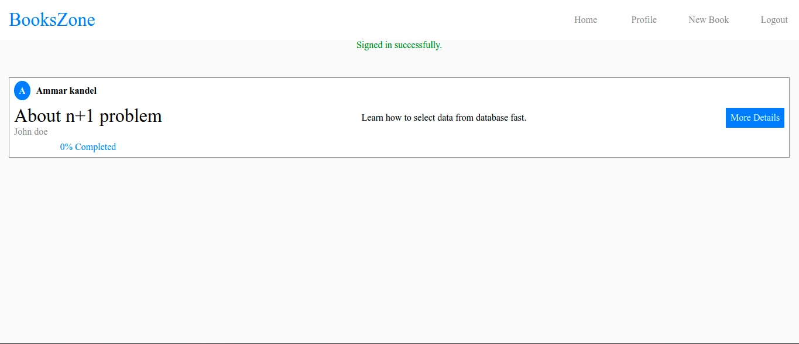
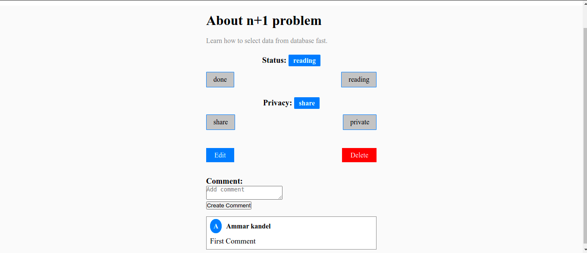

# BooksZone

## About

### This app for users to share their experience with books they read. Users can share books they read or make it private also they can edit their progress and change the status (reading or done). The authenticated users can add comments on the shared books.

## Live Demo

[Live demo](https://books-zone.herokuapp.com/)

## App screens

## How to run this project

- Install Ruby.
- Install Ruby on Rails.
- Install bundle.
- Make sure you inside the folder (terminal).
- Run `bundle install`
- Run `yarn`
- Run `rails db:create`
- Run `rails db:migrate`
- Run `rails server`
- Go to `http:localhost:3000`

## Test-driven development RSPEC

The code includes unit testing using RSpec. To start the test run the next line in your terminal:

`bundle exec rspec`

## Future Features

- Add reply on comments.

## Author

👤 **Ammar El refay Kandel**

- GitHub: [ammarkandel](https://github.com/ammarkandel)
- Twitter: [@AmmarQandel](https://twitter.com/AmmarQandel)
- LinkedIn: [LinkedIn](https://www.linkedin.com/in/ammar-kandel-7b4100193/)

## Show your support

Give a ⭐️ if you like this project!
